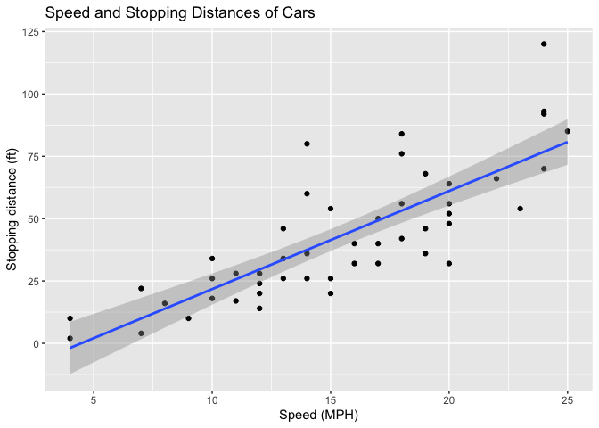
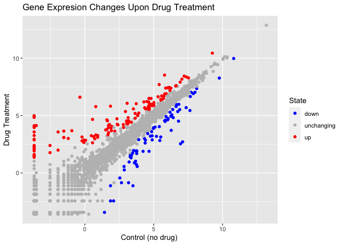
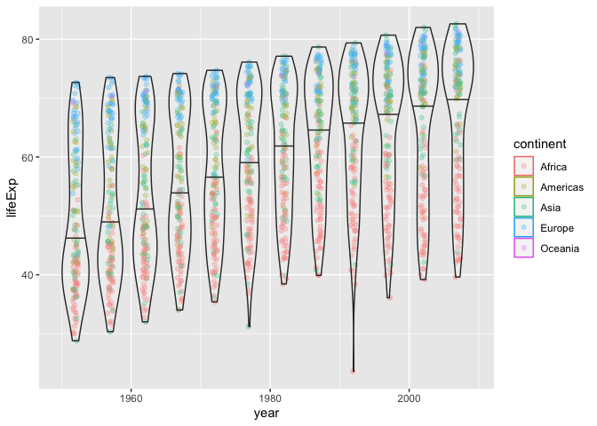

Class 05 Data Visualization
================
Barry Grant (PID 911)
2021-12-02

``` r
# Lets start with a scatterplot
# Before we can use it we need to load it up!
library(ggplot2)

# Every ggplot has a data + aes + geoms
ggplot(data=cars) +
  aes(x=speed, y=dist) +
  geom_point() +
  geom_smooth()
```

    ## `geom_smooth()` using method = 'loess' and formula 'y ~ x'

<!-- -->

``` r
# Change to a liner model 
p <- ggplot(data=cars) +
  aes(x=speed, y=dist) +
  geom_point() +
  geom_smooth(method="lm")

p + labs(title="Speed and Stopping Distances of Cars",
         x="Speed (MPH)",
         y="Stopping distance (ft)")
```

    ## `geom_smooth()` using formula 'y ~ x'

<!-- -->

``` r
# Base graphics is shorter but not as nice 
plot(cars)
```

<!-- -->

``` r
# Lets try a more complicated dataset of gene expression
# First read the dataset
url <- "https://bioboot.github.io/bimm143_S20/class-material/up_down_expression.txt"
genes <- read.delim(url)
head(genes)
```

    ##         Gene Condition1 Condition2      State
    ## 1      A4GNT -3.6808610 -3.4401355 unchanging
    ## 2       AAAS  4.5479580  4.3864126 unchanging
    ## 3      AASDH  3.7190695  3.4787276 unchanging
    ## 4       AATF  5.0784720  5.0151916 unchanging
    ## 5       AATK  0.4711421  0.5598642 unchanging
    ## 6 AB015752.4 -3.6808610 -3.5921390 unchanging

``` r
# Q. How many genes
nrow(genes)
```

    ## [1] 5196

``` r
# Q. How to access State col
table( genes$State )
```

    ## 
    ##       down unchanging         up 
    ##         72       4997        127

``` r
# Q. What % are up/down
prec <- table( genes$State ) / nrow(genes) * 100
round( prec, 2 )
```

    ## 
    ##       down unchanging         up 
    ##       1.39      96.17       2.44

``` r
# Time to plot
ggplot(genes) +
  aes(x=Condition1, y=Condition2, col=State) +
  geom_point() +
  scale_colour_manual(values=c("blue","gray","red")) +
  labs(title="Gene Expresion Changes Upon Drug Treatment",
       x="Control (no drug) ",
       y="Drug Treatment")
```

<!-- -->

``` r
## Gapmider dataset
library(gapminder)
head(gapminder)
```

    ## # A tibble: 6 × 6
    ##   country     continent  year lifeExp      pop gdpPercap
    ##   <fct>       <fct>     <int>   <dbl>    <int>     <dbl>
    ## 1 Afghanistan Asia       1952    28.8  8425333      779.
    ## 2 Afghanistan Asia       1957    30.3  9240934      821.
    ## 3 Afghanistan Asia       1962    32.0 10267083      853.
    ## 4 Afghanistan Asia       1967    34.0 11537966      836.
    ## 5 Afghanistan Asia       1972    36.1 13079460      740.
    ## 6 Afghanistan Asia       1977    38.4 14880372      786.

``` r
ggplot(gapminder) +
  aes(x=year, y=lifeExp, col=continent) +
  geom_jitter(width=0.4, alpha=0.3) +
  #geom_boxplot(aes(group=year), alpha=0.2) +
  geom_violin(aes(group=year), alpha=0.2, draw_quantiles = c(0.5))
```

<!-- -->

``` r
# Convert it to interactive plot
#library(plotly)
#ggplotly()
```
