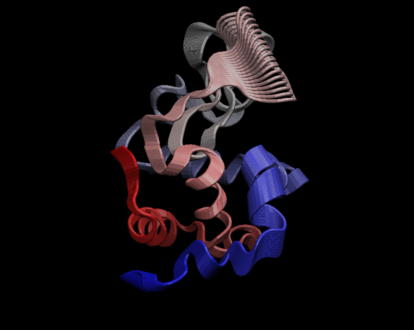
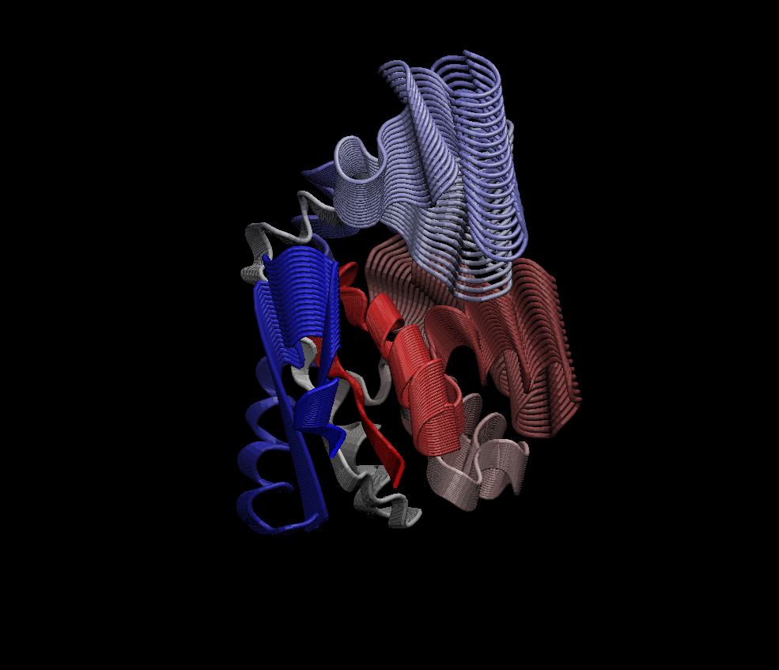

# Comparative analysis of protein structures

Using the bio3d package.

```{r}
library(bio3d)

pdb <- read.pdb("1hel")
pdb
```

Let's use a bioinformatics method called NMA (Normal Mode Analysis) to predict the dynamics (flexibility) of this enzyme.

```{r}
modes <- nma(pdb)
plot(modes)
```

Make a "move" of its predicted motion. We often call this a "trajectory".

```{r}
mktrj(modes, file="nma.pdb")
```



# Analysis of ADK

```{r}
aa <- get.seq("1ake_A")
aa
```
```{r}
# Run BLAST from BLAST
#blast <- blast.pdb(aa)

load("mydata.RData")
```
```{r}
hits <- plot(blast)
```

```{r}
hits$pdb.id
```

```{r}
# Download releated PDB files
#files <- get.pdb(hits$pdb.id, path="pdbs", split=TRUE, gzip=TRUE)

```

Multiple structure alignment
```{r}
pdbs <- pdbaln(files, fit=TRUE)
```

```{r}
pdbs

```

# PCA 

We will use the bio3d pca() function which is designed for protein structure data.

```{r}
# Perform PCA
pc.xray <- pca(pdbs)
plot(pc.xray)
```
Make a trajectory visualization of the the motion captured by the first Principal Component

```{r}
# Visualize first principal component
pc1 <- mktrj(pc.xray, pc=1, file="pc_1.pdb")
```



