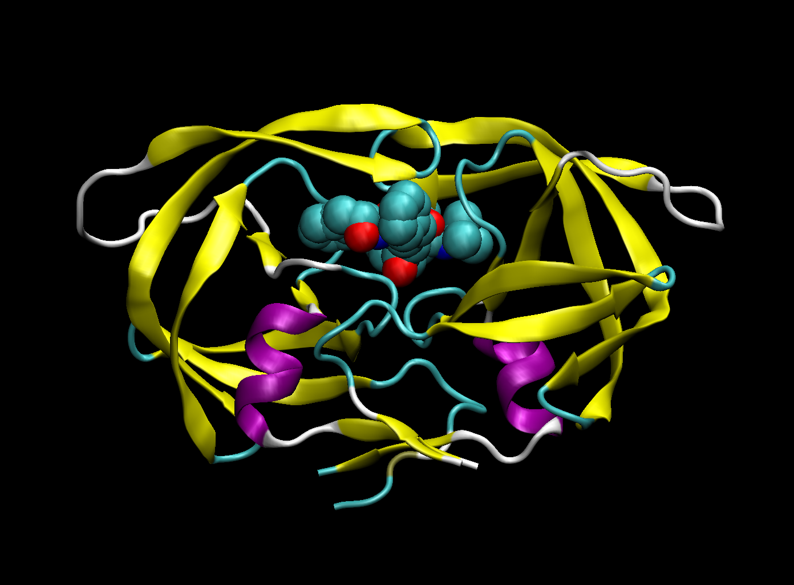

## A quick look at the PDB

```{r}
db <- read.csv("Data Export Summary.csv", row.names=1)
head(db)
```

> Q1. What percentage of structures in the PDB are solved by X-Ray and Electron Microscopy.

```{r}
method.sums <- colSums(db)
round((method.sums/method.sums["Total"]) * 100,2)
```

> Q2: What proportion of structures in the PDB are protein?

```{r}
round((db$Total/method.sums["Total"]) * 100, 2)

```

> Q3: Type HIV in the PDB website search box on the home page and determine how many HIV-1 protease structures are in the current PDB?

1828 Structures

## VMD structure visualization image



Just write text but you have some **formatting** options

# Using Bio3D

I need load the library

```{r}
library(bio3d)

pdb <- read.pdb("1hsg.pdb")
pdb
```

```{r}
aa123( pdbseq(pdb) )
```

The ATOM records

```{r}
head(pdb$atom)
```

```{r}
library(NGLVieweR)
NGLVieweR("1hsg") %>%
 addRepresentation("cartoon", 
    param = list(name = "cartoon",
    colorScheme="residueindex")) %>%
 addRepresentation("spacefill",
    param = list(name="spacefill",
      colorScheme = "element",
      sele = "ligand") )
```

```{r}
NGLVieweR("1hsg") %>%
 addRepresentation("cartoon") %>%
 addRepresentation("spacefill", param = list(sele="ligand")) %>%
  addRepresentation("line", param=list(sele="25")) %>%
  zoomMove(center = "ligand", zoom=20)
```

```{r}
nglv <- function(pdb) {
  temp <- tempfile()
  on.exit(unlink(temp))
  bio3d::write.pdb(pdb = pdb, file = temp)
  out <- NGLVieweR::NGLVieweR(temp, format=".pdb") %>%
    addRepresentation("cartoon") %>%
    addRepresentation("spacefill", param = list(sele="ligand"))
  return(out)
}
```
```{r}
library(r3dmol)
r3dmol() %>%
  m_add_model(data = m_bio3d(pdb)) %>%
  m_set_style(style = m_style_cartoon()) %>%
  m_zoom_to()
```


```{r}
library(r3dmol)

r3dmol() %>%
  m_add_models_as_frames(data = xyz_multiple, format = "xyz") %>%
  m_animate(options = list(loop = "forward", reps = 10)) %>%
  m_set_style(style = m_style_stick(colorScheme = "magentaCarbon")) %>%
  m_zoom_to()
```


```{r}
o <-nglv(pdb)
o
```


