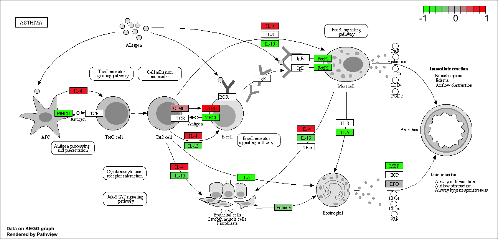

# Background
Our data for today come from Himes et al. RNASeq analysis of the drug dexamethasone, a synthetic glucocorticoid steroid with anti-inflammatory effects (Himes et al. 2014).

Read the countData and colData.

```{r}
counts <- read.csv("airway_scaledcounts.csv", row.names=1)
metadata <- read.csv("airway_metadata.csv")
```

Let's have a look at these

```{r}
head(counts)
```

```{r}
metadata
```

> Q1. How many genes are in this dataset? 

```{r}
nrow(counts)
```


>Q2. How many ‘control’ cell lines do we have?

```{r}
sum(metadata$dex == "control")
```
First I need to extract all the "control" columns. Then I will take the row-wise mean to get the average count values for all genes in these four experiments.

```{r}
control.inds <- metadata$dex == "control"
control.counts <- counts[ , control.inds]
head(control.counts)
```

```{r}
control.mean <- rowMeans(control.counts)
```

Now do the same for the drug treated experiments (i.e. columns)

```{r}
treated.inds <- metadata$dex=="treated"
treated.counts <- counts[ , treated.inds]
head(treated.counts)
treated.mean <- rowMeans(treated.counts)
```

We will combine our meancount data for bookkeeping purposes.

```{r}
meancounts <- data.frame(control.mean, treated.mean)
```

Let's make a quick plot

```{r}
plot(meancounts)
```

This plot indicates that we need a log transformation to see details of our data!

I am going to re-plot on a log-log scale

```{r}
plot(meancounts, log="xy")
```

We often use log2 in this field because it has nice math properties that make interpertation easier.

```{r}
log2(10/10)
```

```{r}
log2(20/10)
```
```{r}
log2(40/10)
```
```{r}
log2(5/10)
```
Cool we see 0 values for no change and + values for increases and minus values for decreases. This nice property leads us to work with **log2(fold-change)** all the time in the genomics and proteomics filed.

Let's add the **log2(fold-change)** values to our `meancounts` dataframe.

```{r}
meancounts$log2fc <- log2(meancounts[,"treated.mean"]/
                            meancounts[,"control.mean"])
head(meancounts)
```
I need to exclude the genes (i.e. rows) with zero counts because we can't say anything about these as we have no data for them! 

```{r}
head(meancounts[,1:2])
```
```{r}
head(meancounts[,1:2] == 0)

```

```{r}
which( c( F,F,T,T) )
```
I can use the **which()** function with the `arr.ind=TRUE` argument to get the columns and rows where the TRUE values are (i.e. the zero counts in our case).

```{r}
zero.vals <- which(meancounts[,1:2] == 0, arr.ind=TRUE)
head(zero.vals)
```

```{r}
to.rm <- unique(zero.vals[,"row"])
head( sort(to.rm) )
```

Now remove these from our `meancounts` dataframe.


```{r}
mycounts <- meancounts[-to.rm,]
head(mycounts)
```

How many do we have left?

```{r}
nrow(mycounts)
```

How many genes are up regulated upon drug treatment? We will use a log2 threshold of +2 for this.

```{r}
sum(mycounts$log2fc > 2)
```
and down regulated genes at the -2 fold change threshold 

```{r}
sum(mycounts$log2fc < -2)
```

## DESeq2 analysis

Let’s do this the right way. DESeq2 is an R package specifically for analyzing count-based NGS data like RNA-seq. It is available from Bioconductor. 


```{r}
library(DESeq2)
```

We need to first setup the input object for deseq

```{r}
dds <- DESeqDataSetFromMatrix(countData=counts, 
                              colData=metadata, 
                              design=~dex)
```

Now we can run DESeq analysis

```{r}
dds <- DESeq(dds)
```
 To get at the results here we use the deseq `results()` function:
 
```{r}
res <- results(dds)
head(res)
```

## Save our results

Write out whole results dataset (including genes that dont change significantly).

```{r}
write.csv(res, file="allmyresults.csv")
```

Focus in on those genes with a small p-value (i.e. show a significant change).

```{r}
res05 <- results(dds, alpha=0.05)
```

```{r}
summary(res05)
```

 
## Volcano plots

Let’s make a commonly produced visualization from this data, namely a so-called Volcano plot. These summary figures are frequently used to highlight the proportion of genes that are both significantly regulated and display a high fold change.

```{r}
plot(res$log2FoldChange, res$padj)
```

That is not a useful plot because all the small p-values are hidden at the bottom of the plot and we can't really see them. Log will help.

```{r}
plot(res$log2FoldChange, log(res$padj))
```

We can flip this pvalue axis by just putting a minus sign on it then we will have the classic volcano plot that the rest of the world uses.

```{r}
plot(res$log2FoldChange, -log(res$padj))
```

Finally let's add some color to this plot to draw attention to the genes (i.e. points) we care about - that is those with large fold-change and low pvalues (i.e. high -log(pvalues)).

```{r}
plot(res$log2FoldChange, -log(res$padj))
abline(v=c(-2, +2), col="gray")
abline(h=-log(0.05), col="gray")
```

Now add some color to the points:

```{r}
mycols <- rep("gray", nrow(res))
mycols[ abs(res$log2FoldChange) > 2 ] <- "red"
mycols[ res$padj > 0.05 ] <- "gray"
```


```{r}
plot(res$log2FoldChange, -log(res$padj), col=mycols)
abline(v=c(-2, +2), col="gray")
abline(h=-log(0.05), col="gray")

```


## Add annotation data for our genes.

For this we need two bioconductor packages
- BiocManager::install("AnnotationDbi")
- BiocManager::install("org.Hs.eg.db")

```{r}
library(AnnotationDbi)
library(org.Hs.eg.db)
```

Let's have a look at what is in the `org.Hs.eg.db`

```{r}
columns(org.Hs.eg.db)
```

We will use the `mapIDs` function to translate between identifiers from different databases.

```{r}
res$symbol <- mapIds(org.Hs.eg.db,
                     keys=row.names(res), # Our genenames
                     keytype="ENSEMBL",   # Their format
                     column="SYMBOL",     # new format we want
                     multiVals="first")
```

We need ENTREZ ids for pathway analysis with KEGG.

```{r}
columns(org.Hs.eg.db)
```

```{r}
res$entrez <- mapIds(org.Hs.eg.db,
                     keys=row.names(res), # Our genenames
                     keytype="ENSEMBL",   # Their format
                     column="ENTREZID",     # new format we want
                     multiVals="first")
```

```{r}
head(res)
```


```{r}
head(res)
```

Let's make another volcano plot with some gene labels 
For this we can use the **EnhancedVolcano** package

```{r}
library(EnhancedVolcano)
```


```{r}
x <- as.data.frame(res)

EnhancedVolcano(x,
    lab = x$symbol,
    x = 'log2FoldChange',
    y = 'pvalue')
```


## Pathway analysis/geneset annotation

```{r}
library(pathview)
library(gage)
library(gageData)

data(kegg.sets.hs)

# Examine the first 2 pathways in this kegg set for humans
head(kegg.sets.hs, 2)
```

The main **gage()** function requires a named vector of fold changes, where the names of the values are the Entrez gene IDs.

```{r}
#res$entrez
foldchange <- res$log2FoldChange
names(foldchange) <- res$entrez

head(foldchange)
```

```{r}
# Get the results
keggres = gage(foldchange, gsets=kegg.sets.hs)
```

```{r}
attributes(keggres)
```
This separates out results by "greater" and "less" i.e. those that are up regulated and those that are down regulated.


```{r}
# Look at the first three down (less) pathways
head(keggres$less, 3)
```

Now, let’s try out the `pathview()` function from the **pathview** package to make a pathway plot with our RNA-Seq expression results shown in color.

```{r}
pathview(gene.data=foldchange, pathway.id="hsa05310")
```





