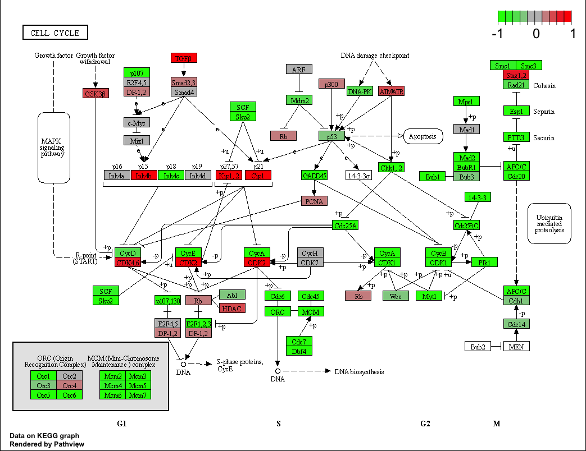

# Background
The data for for hands-on session comes from GEO entry: GSE37704, which is associated with the following publication:

> Trapnell C, Hendrickson DG, Sauvageau M, Goff L et al. "Differential analysis of gene regulation at transcript resolution with RNA-seq". Nat Biotechnol 2013 Jan;31(1):46-53. PMID: 23222703

The authors report on differential analysis of lung fibroblasts in response to loss of the developmental transcription factor HOXA1. 

# 1. Data Import

```{r}
metaFile <- "GSE37704_metadata.csv"
countFile <- "GSE37704_featurecounts.csv"

# Import metadata and take a peak
colData = read.csv(metaFile, row.names=1)
head(colData)
```

```{r}
countData = read.csv(countFile, row.names=1)
head(countData)
```

We need to get rid of this funny first column

```{r}
countData <- countData[,-1]
head(countData)
```

# 2. DESeq analysis

Load the package
```{r}
library(DESeq2)
```

Setup the object required by DESeq

```{r}
dds = DESeqDataSetFromMatrix(countData=countData,
                             colData=colData,
                             design=~condition)
```

Run the DESeq analysis

```{r}
dds = DESeq(dds)

```

Get our results

```{r}
res <- results(dds)
head(res)
```

```{r}
summary(res)
```

# Add annotation

Here we use the AnnotationDbi package to add gene symbols and entrez ids to our results.

```{r}
library(AnnotationDbi)
library(org.Hs.eg.db)
```

Quick reminder of what ID types are available in the `org.Hs.eg.db` dataset.

```{r}
columns(org.Hs.eg.db)
```

We want to add gene symbols and entrez ids

```{r}
res$symbol <- mapIds(org.Hs.eg.db,
                     keys=row.names(res),
                     keytype="ENSEMBL",
                     column="SYMBOL",
                     multiVals = "first")

```

```{r}
res$entrez <- mapIds(org.Hs.eg.db,
                     keys=row.names(res),
                     keytype="ENSEMBL",
                     column="ENTREZID",
                     multiVals = "first")

```

# Volcano Plot

```{r}
plot(res$log2FoldChange, -log(res$padj))
```

I will try EnhancedVolcano plot

```{r}
library(EnhancedVolcano)

x <- as.data.frame(res)

EnhancedVolcano(x,
                lab=x$symbol,
                x = 'log2FoldChange',
                y = 'pvalue')
```


# PCA plot


```{r}
head(countData)
```

```{r}
countsnozero <- countData[rowSums(countData) != 0, ]
head(countsnozero)
```

```{r}
pca <- prcomp(t(countsnozero))
```

```{r}
mycols <- rep(c("red", "blue"), each=3)
mycols
```

```{r}
plot(pca$x[,1:2], col=mycols, pch=16)
```

# 5. Pathway Analysis

```{r}
library(pathview)
library(gage)
library(gageData)

```

Focus on the signalling subset of KEGG

```{r}
data(kegg.sets.hs)
data(sigmet.idx.hs)

# Focus on signaling and metabolic pathways only
kegg.sets.hs = kegg.sets.hs[sigmet.idx.hs]

```

```{r}
foldchanges = res$log2FoldChange
names(foldchanges) = res$entrez
head(foldchanges)
```
```{r}
# Get the results
keggres = gage(foldchanges, gsets=kegg.sets.hs)
```


```{r}
head(keggres$less)

```


```{r}
pathview(gene.data=foldchanges, pathway.id="hsa04110")

```




## GO (Gene Ontology)

We can also do a similar procedure with gene ontology. Similar to above, go.sets.hs has all GO terms. go.subs.hs is a named list containing indexes for the BP, CC, and MF ontologies. Let’s focus on BP (a.k.a Biological Process) here.

```{r}
data(go.sets.hs)
data(go.subs.hs)

# Focus on Biological Process subset of GO
gobpsets = go.sets.hs[go.subs.hs$BP]

gobpres = gage(foldchanges, gsets=gobpsets, same.dir=TRUE)

lapply(gobpres, head)
```


```{r}
go2 <- gage(foldchanges, gsets=gobpsets)
```

```{r}
head(go2$less)
```


